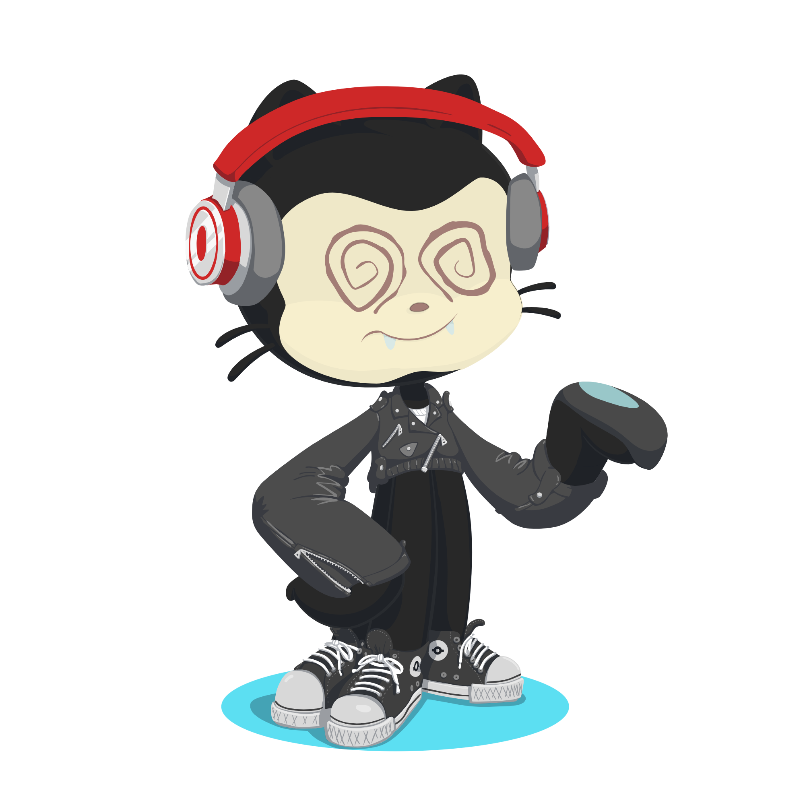

# <hello, world! />

## Qualifications
### Higher Education
#### Valencia College
- Sophomore Psychology Major
- Junior Computer Science Major

### Certificates
#### Harvard University
- CS50’s Introduction to Computer Science
- CS50’s Introduction to Programming with Python
- CS50’s Introduction to Cybersecurity

## <b> Skills</b>

### Languages

### Software and Tools

### Learning

## <b> GitHub Stats</b>

